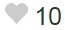

# Angular2-102

In this part you will learn more about building Component with Input Property (similar to WPF Dependency Property). Most of the samples are from the course [Angular 2 with TypeScript](https://www.udemy.com/angular-2-tutorial-for-beginners/learn/v4/overview) by Mosh Hamedi on Udemy.
I develop  the Angular 2 samples along way I'm learning Angular 2. If you have time, I recommend you to take the course because it has richer contents.
- [Jumpstart](https://github.com/dacho68/Angular2-Jumpstart) - Quick understanding of how to build an App with Angular 2.
- [101](https://github.com/dacho68/Angular2-101) - Property Binding, Class and Style Binding, Event Binding, Two way Binding.
- 102 - Component API in depth.
- 103

## Setup the environment on Windows for running the samples
- First instal [NodeJs](https://nodejs.org/en/)
- Install typescript globally

```
npm install -g typescript
npm install -g typings
```

We are going to use [Visual Studio Code](http://code.visualstudio.com/) for editing our project
after you checkout this repository. Run the command below for install the dependencies

```
npm install
npm start
```

## Input Properties

   Angular automatically updates data-bound properties during change detection 
   
   **Syntax :**
   
``` typescript
    @Input('alias name') propertyName; // add the Input decorator (@Input()) in your class component.
```
Using the alias to expose the alias name as the public input name but keep the actual property name as a private property.

However if you don't want to use the Input decorator, you can add the input property in the inputs metadata of the component as the code below. Personally I like to use the Input decorator

``` typescript
    @Component({
        // element selector my-app
        selector: 'favorite', 
        template: `
            <span class="glyphicon" 
            [class.glyphicon-star-empty]="!isFavorite"
            [class.glyphicon-star]="isFavorite"
            (click)="onClick($event)" ></span>
        `,
        // including 
    directives:[ ],
    inputs: ['isFavorite']  // we want to expose the isFavorite to public for binding
    })

    export class FavoriteComponent {
    isFavorite: boolean = false;   
    onClick($event){
        this.isFavorite = !this.isFavorite;
    }
  
```
 
See: [Input/Output Property Example](https://github.com/dacho68/Angular2-102/blob/master/app/favorite.component.ts)  

Bind to an input sample :
``` typescript 
    @Component({
        selector: 'my-app',
        template: `<h1>Welcome to Angular 2 - 102</h1>
                My Favorite : <favorite [is-favorite]="post.isFavorite"></favorite>
                `,
    directives:[ FavoriteComponent ]
    })

    export class AppComponent {
    post = {
        title: "Title",
        isFavorite: true
    }
```
## Output Properties

When an output property emits an event, an event handler attached to that event the template is invoked.
  
   **Syntax :**
   
``` typescript
    @output('alias name') propertyName = new EventEmitter; 
```

The Output Property can also declare in the metadata of the component. And the alias name has the same purpose as the Input Property.

## Templates

The template url is useful when you have a very large template then you want to keep your template in a separate file. 
The draw back is this will cost you one more http request on the first call. Personnally, I do my best to keep the template inline.  
   
   **Syntax :**
   
``` typescript
   template:'...' //or
   templateUrl: 'path/your_template_file.html', 
```

Example :

``` typescript
@Component({
    selector: 'favorite', 
    // using templateURL will cost you one more HTTP request
    templateUrl: 'app/favorite.template.html' 
}) 
```

## Styles

it's similar to the template concept, there is inline styles[] and the stylesUrl[]

   **Syntax :**
   
``` typescript
   styles:[`...`] //or
   stylesUrl: ['path/your_css_file.css','...'] 
```

Example : Inline Style 

``` typescript
@Component({
    selector: 'favorite', 
    templateUrl: 'app/favorite.template.html', 
    styles:[`
        .glyphicon-star{
            color: orange;
        }
    `],
}) 
```

## Exercise 1 - Like Component
Make a glyphicon heart when you click on it, the counter increases by one and the color changes to pink  . If you click it again . it goes back to gray and decreases by one .  
the mouse hover also changes the mouse cursor to pointer.

use the glyphicon from bootstrap to render the icon

__Specification :s__
``` html5   
    glyphicon-heart
    light gray : #ccc
    pink: deeppink
    cursor: pointer
```
See: [Solution](https://github.com/dacho68/Angular2-102/blob/master/app/like2.component.ts)
    

## Exercise 2 - Vote Component
Make a vote component as you see on the stack overflow website. The user can only have one vote up and one vote down. This image  illustrates the look and feel of the component.

__Specifications :__
``` html5   
    glyphicon-menu-up
    glyphicon-menu-down
    width: 20px
    
    Public API
      Input Properties : voteCount and myVote
      Output Properties : vote
```  
See: [Solution](https://github.com/dacho68/Angular2-102/blob/master/app/voter.component.ts)

**Useful References**
[Angular 2 Style Guide](https://github.com/dacho68/angular2-style-guide)